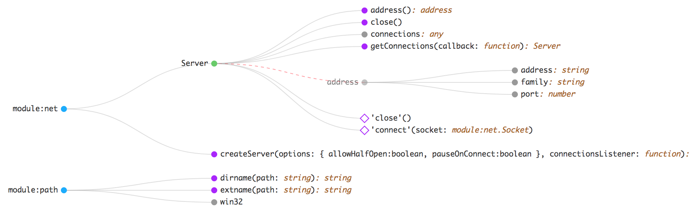

# JavaScript API Specification

> Work in progress

In the past few years [OpenAPI](https://github.com/OAI/OpenAPI-Specification) (formerly Swagger) has become a de-facto standard for describing REST APIs, while a format for non-REST APIs is still lacking.

This is particularly challenging in dynamically typed languages like JavaScript, which despite its popularity still has no consistant way to desribe an API for a consumer.

Various formats do exist though and each project/vendor seem to have their own way of describing their interface:

- The JSON output from the [JSDoc3](https://github.com/jsdoc3/jsdoc) project comes a long way, but it's primary focus is to generate documentation, not describe the annotated API.
- [documentationjs](https://github.com/documentationjs/documentation) also provides a very good JSON structure, but again the project is more focused on generating documentation.
- [esdoc](https://github.com/esdoc/esdoc) has a very good plugin architecture, outputting a structured JSON should be possible.
- NodeJS has a JSON representation of each one of their modules, e.g. [net.html](https://nodejs.org/api/net.html) and [net.json](https://nodejs.org/api/net.json)

## Purpose

The purpose of this project is to define and provide a standard for describing JavaScript APIs. By defining a machine-readable format of the consumable API, additional tools can be created based on the provided specification:

- Generate API reference documentation
- Generate typings (TypeScript, Flow etc.)
- Visualize the API to provide an overview
- Assist in API governance by comparing versions and detecting added/deprecated/removed endpoints

## Examples

- [nodejs](./packages/jsdoc2spec/examples/nodejs)

## Current Version

[Draft of specification](./packages/js-api-spec/specifications/draft.md)

[JSON schema](./packages/js-api-spec/schemas/schema.json)

## Tools

- [jsdoc2spec](./packages/jsdoc2spec) A tool that generates an API specification from JSDoc annotations
- Markdown API reference documentation (coming soon)
- Visualize API (coming soon)
    
    > A visual representation of [nodejs/spec.json](./examples/nodejs/spec.json)
